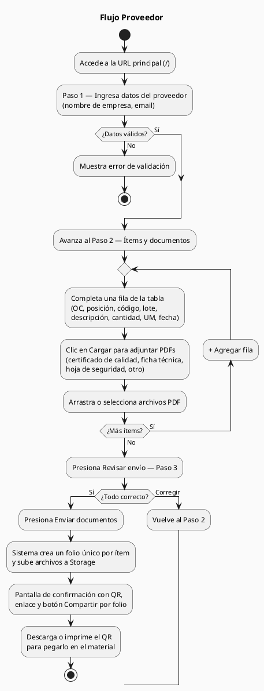
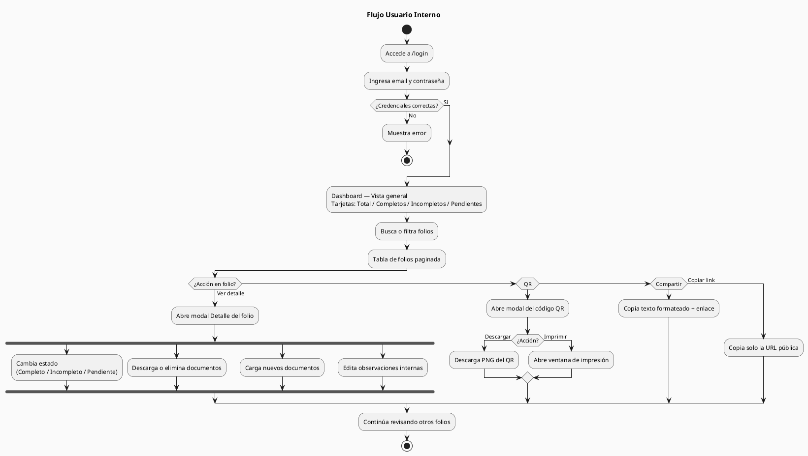
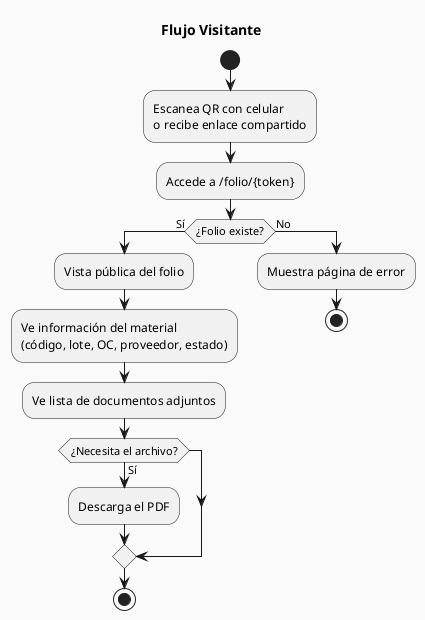
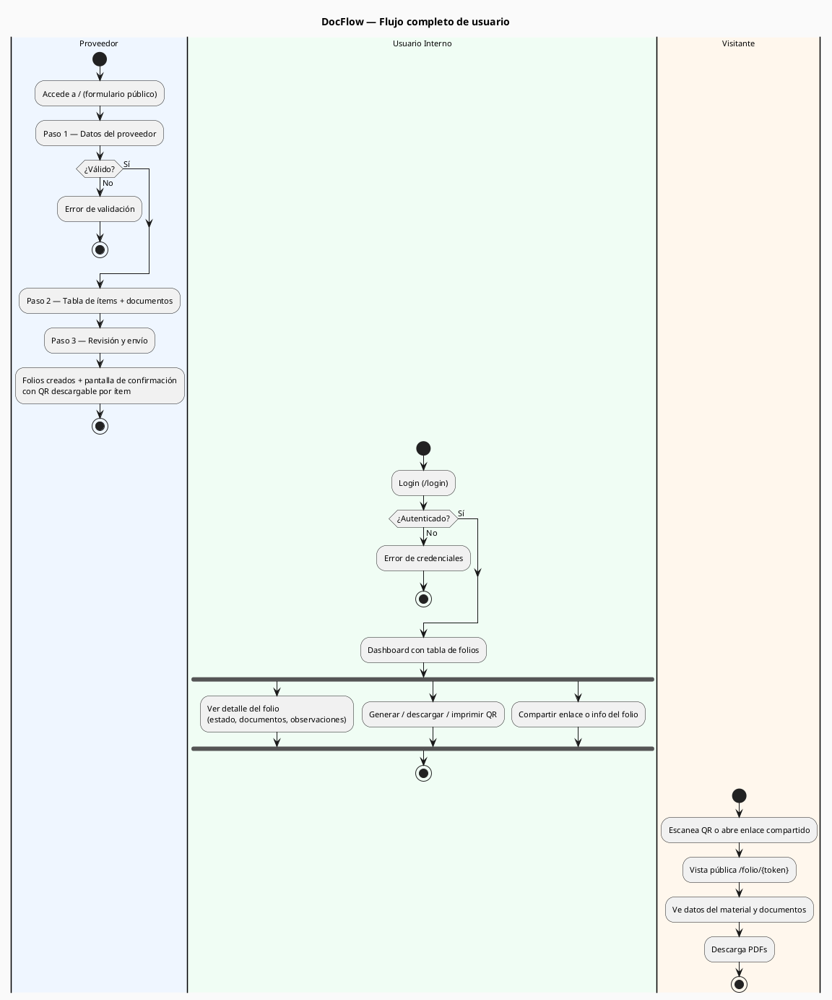

# Diagrama de Flujo de Usuario — DocFlow

Este documento describe los flujos de usuario del sistema DocFlow. El código PlantUML correspondiente está en [`diagrama_flujo.puml`](./diagrama_flujo.puml).

Para renderizar el diagrama puedes usar:
- [PlantUML Online Server](https://www.plantuml.com/plantuml/uml/)
- Extensión **PlantUML** para VS Code
- [Kroki.io](https://kroki.io/)

---

## Flujos del sistema

El sistema tiene **tres tipos de usuario**, cada uno con su propio flujo independiente:

| Actor | Punto de entrada | Autenticación |
|-------|-----------------|---------------|
| Proveedor | `/` (URL pública) | No requiere |
| Usuario interno | `/login` | Email + contraseña |
| Visitante | `/folio/{token}` (QR o enlace) | No requiere |

---

## Flujo 1 — Proveedor

### Descripción del flujo

1. El proveedor ingresa a la URL pública sin necesidad de crear cuenta
2. **Paso 1** — Completa el nombre de la empresa y su email de contacto
3. **Paso 2** — Llena una tabla editable (estilo Excel) con un ítem por fila, adjuntando los PDFs correspondientes por tipo de documento
4. **Paso 3** — Revisa el resumen antes de confirmar el envío
5. Al enviar, el sistema genera un folio único por material con su código QR
6. El proveedor descarga o imprime el QR para pegarlo físicamente en el empaque

---

## Flujo 2 — Usuario interno

### Descripción del flujo

1. El usuario ingresa con sus credenciales en `/login`
2. Accede al dashboard con indicadores resumidos en tarjetas
3. Puede buscar folios por texto libre o filtrar por estado
4. Por cada folio puede:
   - **Ver detalle**: modal completo con cambio de estado, gestión de documentos y observaciones
   - **QR**: descargar o imprimir el código QR
   - **Compartir**: copiar un mensaje formateado con información y enlace
   - **Copiar link**: copiar solo la URL pública

---

## Flujo 3 — Visitante (QR o enlace)

### Descripción del flujo

1. El visitante escanea el QR pegado en el material físico, o recibe el enlace por mensaje
2. Accede directamente a la vista pública del folio sin login
3. Ve la información completa del material y todos los documentos adjuntos
4. Puede descargar cualquier PDF directamente desde el navegador o celular

---

## Diagrama completo integrado

El siguiente diagrama muestra los tres flujos en paralelo con sus actores diferenciados por color:

- 🔵 **Azul** — Flujo del proveedor
- 🟢 **Verde** — Flujo del usuario interno  
- 🟠 **Naranja** — Flujo del visitante

